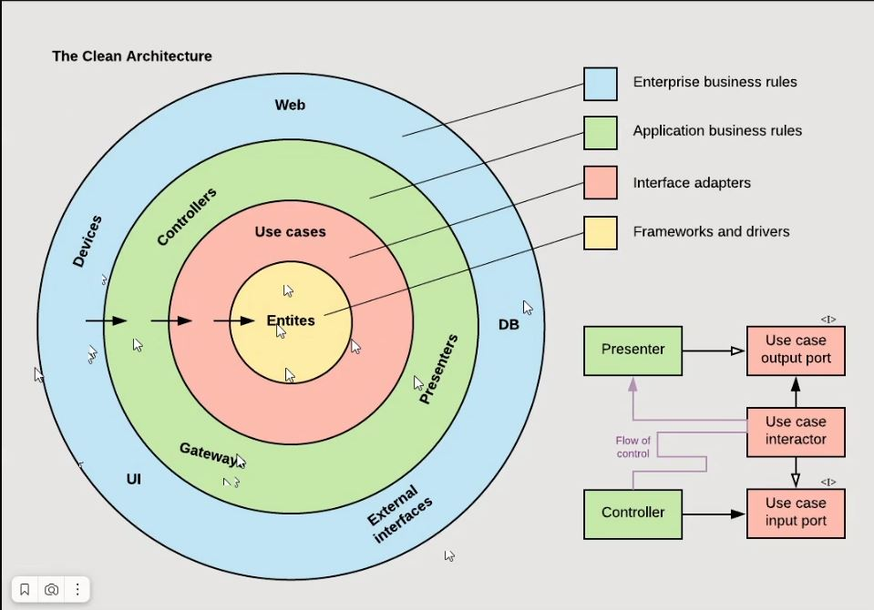
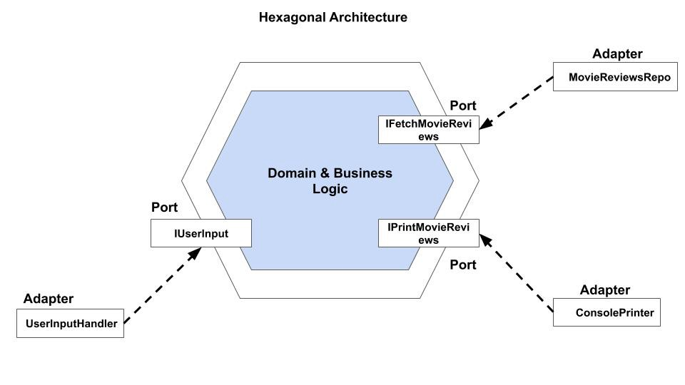
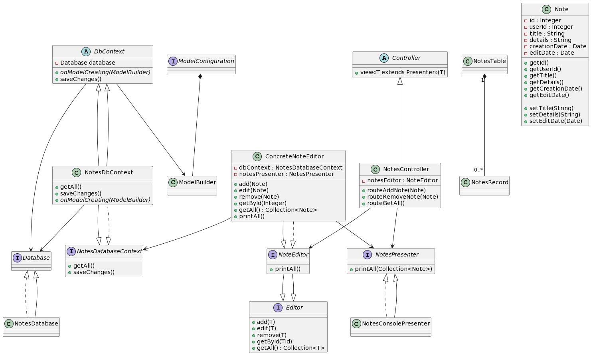

# Урок 6. Принципы построения приложений «чистая архитектура»

### Диаграмма чистой архитектуры:

### Диаграмма шестигранной архитектуры:

### Реализация шестигранной архитектуры.

## HW
Разработать полную ERD домена в https://www.dbdesigner.net/

